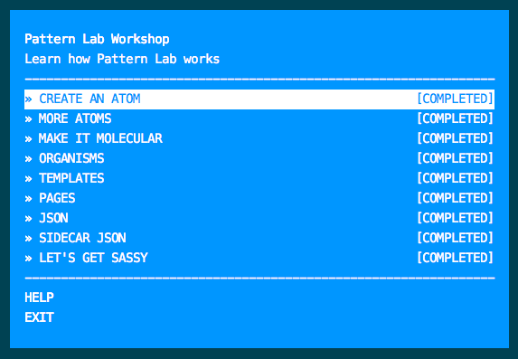

# Pattern Lab Workshopper

## Code Example

Show what the library does as concisely as possible, developers should be able to figure out **how** your project solves their problem by looking at the code example. Make sure the API you are showing off is obvious, and that your code is short and concise.

## Motivation

This workshopper aims to explain the concepts behind Pattern Lab. [http://patternlab.io/docs/index.html]
Pattern Lab is wicked cool and you should use it! 

## Installation
This will change once it's published to npm. 
Once that happens installation will probably be `npm install -g pattern-lab-workshop`

But until then:

git clone the repo
Inside that folder type
`npm install`
`npm link`

Make a new folder somewhere else to run the workshop in.

cd into that folder and type `pattern-lab-workshop` in the terminal.

## API Reference
Pattern Lab docs: [http://patternlab.io/docs/index.html]
Mustache docs: [http://mustache.github.io/mustache.5.html]
git-it (the workshopper this is based off of): [https://github.com/jlord/git-it]

## Tests

`pattern-lab-workshop` to open the menu
`pattern-lab-workshop verify` to test your submission

## Contributors

Let people know how they can dive into the project, include important links to things like issue trackers, irc, twitter accounts if applicable.

## License

A short snippet describing the license (MIT, Apache, etc.)
